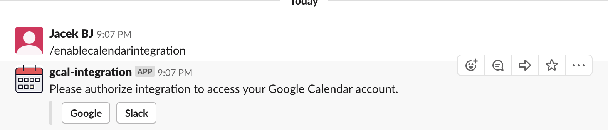

# Google Calendar Slack integration

MVP of Slack app which sets user's status to "In a meeting" when there is a confirmed meeting in Google Calendar.
The status is removed once event finishes.

This is basically a part of https://slack.com/app-pages/google-calendar app.
I developed it to get more familiar with Google Cloud Functions and Slack API.

This integration can be used only in the dev workspace.

### How it works

User enters Slack Slash command, which displays two authorization buttons.

Upon clicking on any of them, OAuth2 process is started.
User authorizes the app to access their Slack profile and Google Calendar events.

After successful authorization, the app queries Google Calendar events list.
It selects an event which is confirmed and starts within a minute.
Then it sets the status to "In a meeting", which is also set to be cleared by Slack based on event's end.

The app uses Google Cloud Functions with Node.js runtime.

## Development

### Prerequisites
Google Project with Cloud Functions, Firestore, Cloud Pub/Sub and Cloud Scheduler APIs enabled.
Pub/Sub and Scheduler are used to launch calendar check every minute.

### Commands
`yarn` - installs all dependencies

`yarn deploy` - deploys Cloud Functions

`yarn deploy-scheduler` - deploys Cloud Scheduler

`yarn deploy-pubsub` - deploys Cloud Pub/Sub topic

### Project-specific variables and credentials
`credentials.json` is a merge of Google app account key and Slack app data.

Backend publishes debug data to Slack topic "calendar" dev workspace.
For that purpose one needs to create a webhook.

## Missing parts
1. Revoking access to Slack/Google Calendar.
1. Validating OAuth2 calls using random `state` variable.
1. Move to Typescript.
1. Enable Cloud Deploy from Github.
1. Add Slack integration for monitoring project budget.
1. Prep Slack part for [distribution](https://api.slack.com/slack-apps#distribute).
1. Validate app with Google to avoid "It's reaaaly dangerous" warning.
1. Change color of Slack buttons depending on user's authorization statuses.
